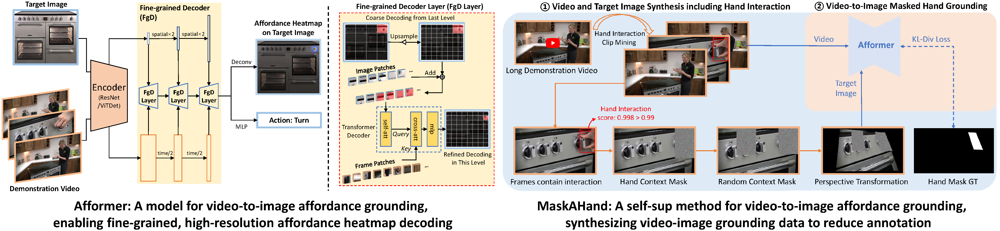

[](https://paperswithcode.com/sota/video-to-image-affordance-grounding-on-opra?p=affordance-grounding-from-demonstration-video-1)
[](https://paperswithcode.com/sota/video-to-image-affordance-grounding-on-opra-1?p=affordance-grounding-from-demonstration-video-1)
[](https://paperswithcode.com/sota/video-to-image-affordance-grounding-on-epic?p=affordance-grounding-from-demonstration-video-1)

# Affordance Grounding from Demonstration Video to Target Image

This repository is the official implementation of [Affordance Grounding from Demonstration Video to Target Image](https://arxiv.org/abs/2303.14644):



 
```
@inproceedings{afformer,
  author  = {Joya Chen and Difei Gao and Kevin Qinghong Lin and Mike Zheng Shou},
  title   = {Affordance Grounding from Demonstration Video to Target Image},
  booktitle = {CVPR},
  year    = {2023},
}
```

## Install

### 1. PyTorch 

We now support PyTorch 2.0. Other version should be okay.

```
conda install -y pytorch torchvision pytorch-cuda=11.8 -c pytorch -c nvidia
```

*NOTE: If you want to use PyTorch 2.0, you should install CUDA >= 11.7. See https://pytorch.org/.*

### 2. PyTorch Lightning

We use PyTorch Lightning 2.0 as the training and inference engines.

```
pip install lightning jsonargparse[signatures] --upgrade
```

### 3. xFormers

We use memory-efficient attention in [xformers](https://github.com/facebookresearch/xformers). Currently PyTorch 2.0 does not support memory-efficient attention relative positional encoding (see [pytorch/issues/96099](https://github.com/pytorch/pytorch/issues/96099)). We will update this repo when PyTorch supports this.

```
pip install triton --upgrade
pip install --pre xformers
```

### 4. Timm, Detectron2, Others

We borrow some implementations from [timm](https://github.com/huggingface/pytorch-image-models) and [detectron2](https://github.com/facebookresearch/detectron2).

```
pip install timm opencv-python av imageio --upgrade
python -m pip install 'git+https://github.com/facebookresearch/detectron2.git'
```

## Dataset

* Downloading OPRA dataset from https://github.com/kuanfang/opra. Due to the copyright issue, you may need to download the original video from YouTube.

* We have uploaded our organized annotation json files to [datasets/opra/annotations](datasets/opra/annotations). Now your datasets file tree should be:
```
datasets
└── opra
    ├── annotations
    │   ├── test.json
    │   ├── train.json
    ├── clips
    │   ├── aocom
    │   ├── appliances
    │   ├── bestkitchenreview
    │   ├── cooking
    │   ├── eguru
    │   └── seattle
    └── images
        ├── aocom
        ├── appliances
        ├── bestkitchenreview
        ├── cooking
        ├── eguru
        └── seattle
```

* *We are working on organizing EPIC-Hotspot and AssistQ Buttons. They will be released as soon as possible.*

## Afformer Model

*Hint: We recommend you to read [LightningCLI](https://lightning.ai/docs/pytorch/stable/cli/lightning_cli.html) if you firstly use it. That helps you better use these commands.*

### 1. ResNet-50-FPN encoder

* You dont need to manually download pre-trained encoder weight. ```torchvision``` will automatically download it. See [torchvision.models.detection.fasterrcnn_resnet50_fpn_v2](https://pytorch.org/vision/main/models/generated/torchvision.models.detection.fasterrcnn_resnet50_fpn_v2.html) for details.

* Training Afformer with ResNet-50-FPN encoder with
```shell
python main.py fit --config configs/opra/r50fpn.yaml --trainer.devices 8 --data.batch_size_per_gpu 2
```

* The training log is saved in `outputs/` by default. You can launch a tensorboard to monitor this folder:
```shell
tensorboard --logdir outputs/ --port 2333
# Then you can see real-time losses, metrics at http://localhost:2333/ 
```

* The evaluation would be done each 1k iterations during training. You can also evaluate with the `validate` command. For example, 
```shell
python main.py validate --config configs/opra/r50fpn.yaml --trainer.devices 8 --data.batch_size_per_gpu 2 --ckpt outputs/opra/r50fpn/lightning_logs/version_0/checkpoints/xxxx.ckpt
```

### 2. ViTDet-B encoder

* Downloading [ViTDet-B-COCO weights](https://dl.fbaipublicfiles.com/detectron2/ViTDet/COCO/mask_rcnn_vitdet_b/f325346929/model_final_61ccd1.pkl) and then put it to [weights/](weights/) folder: ```weights/mask_rcnn_vitdet_b_coco.pkl```.

* Training Afformer with ViTDet-B encoder with
```shell
python main.py fit --config configs/opra/vitdet.yaml --trainer.devices 8 --data.batch_size_per_gpu 2
```

* The training log is saved in `outputs/` by default. You can launch a tensorboard to monitor this folder:
```shell
tensorboard --logdir outputs/ --port 2333
# Then you can see real-time losses, metrics at http://localhost:2333/ 
```

* The evaluation would be done each 1k iterations during training. You can also evaluate with the `validate` command. For example, 
```shell
python main.py validate --config configs/opra/vitdet_b.yaml --trainer.devices 8 --data.batch_size_per_gpu 2 --ckpt outputs/opra/vitdet_b/lightning_logs/version_0/checkpoints/xxxx.ckpt
```

### 3. Visualization

```shell
python demo.py --config configs/opra/vitdet_b.yaml --weight weights/afformer_vitdet_b_v1.ckpt --video demo/video.mp4 --image demo/image.jpg --output demo/output.gif
```

 

* Hint: we carefully fine-tuned a very strong ViTDet model, which is better than paper reported. [Download it](https://drive.google.com/uc?export=download&id=1bvgBwkRJhA2hxInrPPHlwlGH3tNfDciX). 

## MaskAHand Pre-training

*NOTE: A detailed tutorial will be done as soon as possible.*

### 1. Hand Interaction Detection

* Downloading our trained hand interaction detector weights in this [url](https://drive.google.com/uc?export=download&id=1Ha_Jo5KJckRKo4bSTIBJ9EE5NDXIhmam). Then put it to [weights/](weights/) folder: ```weights/hircnn_r50fpnv2_849.pth```.

* The video demo by this hand interaction detector:

 

* *Hint: we trained this simple and accurate hand interaction detector using 100DOH + some Ego datasets. It achieves 84.9 hand+interaction detection AP on 100DOH test set. For MaskAHand pre-training, this weight is enough. We will release its full source code at [chenjoya/hircnn](https://github.com/chenjoya/hircnn) as soon as possible.*

### 2. Hand Interaction Clip Mining

* Make sure your data preparation follows [Dataset](#dataset) part.

* Running [affominer/miner.py](afformer/miner.py). The generated data will be saved at `affominer/outputs`.

### 3. Target Image Synthesis and Transformation

This would be done during training. You can set the hyper-parameters in [configs/opra/maskahand/pretrain.yaml](configs/opra/maskahand/pretrain.yaml):

```yaml
mask_ratio: 1.0
num_masks: 2
distortion_scale: 0.5
num_frames: 32
clip_interval: 16
contact_threshold: 0.99
```

### 4. MaskAHand Pre-training

```shell
python main.py fit --config configs/opra/maskahand/pretrain.yaml
```

### 5. Fine-tuning or Zero-shot Evaluation

* Fine-tuning the MaskAHand pre-trained weight by

```shell
python main.py fit --config configs/opra/maskahand/finetune.yaml 
```

* Zero-shot evaluate the MaskAHand pre-trained weight by

```shell
python main.py validate --config configs/opra/maskahand/pretrain.yaml
```

### 6. Visualization

You can refer to [demo.py](demo.py) to visualize your model results.

## Contact

This repository is developed by [Joya Chen](https://chenjoya.github.io/).  Questions and discussions are welcome via joyachen@u.nus.edu.

## Acknowledgement

Thanks to all co-authors of the paper, [Difei Gao](https://scholar.google.com/citations?user=No9OsocAAAAJ&hl=en), [Kevin Qinghong Lin](https://qinghonglin.github.io/), and [Mike Shou](https://sites.google.com/view/showlab) (my supervisor). Also appreciate the assistance from Dongxing Mao and [Jiawei Liu](https://jia-wei-liu.github.io/). 
